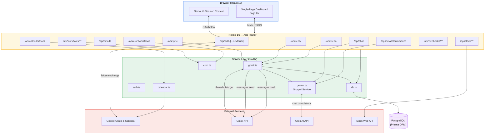
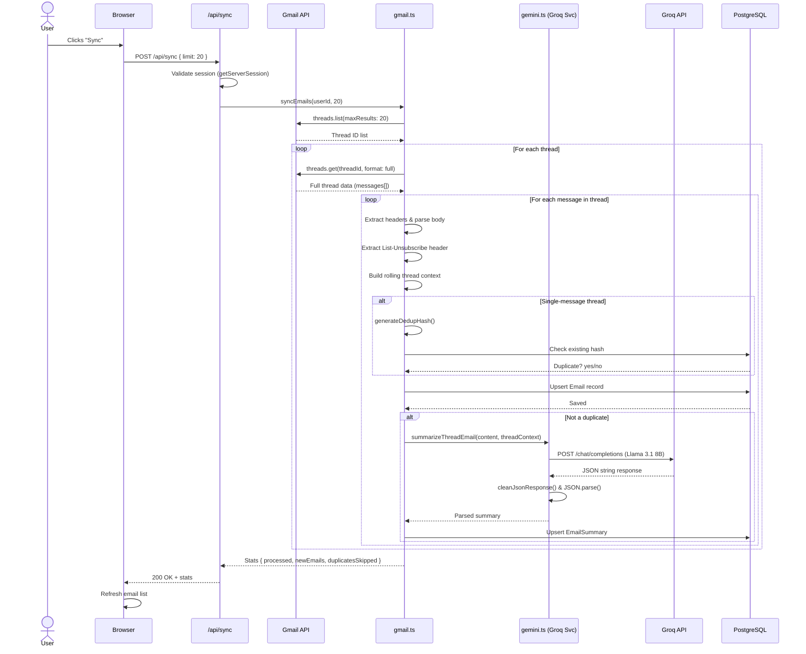
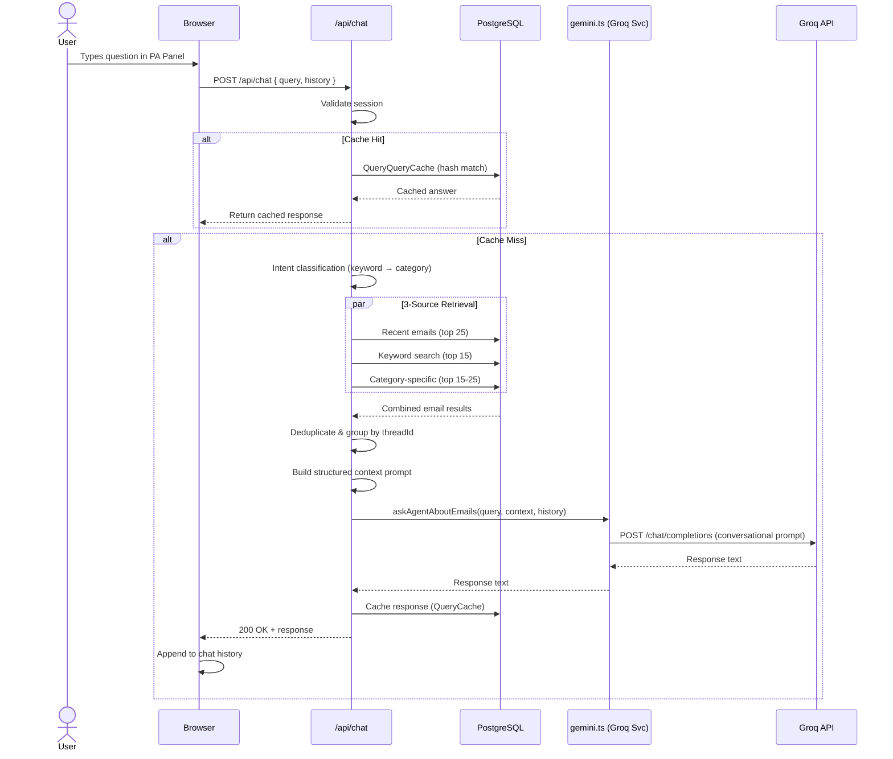

# Aether — Technical Architecture

> **Focused Gmail Intelligence Platform**
> Version 0.1.0 · Next.js 16 · React 19 · Prisma · Groq AI API

---

## Table of Contents

- [1. Overview](#1-overview)
- [2. System Architecture](#2-system-architecture)
- [3. Technology Stack](#3-technology-stack)
- [4. Frontend Architecture](#4-frontend-architecture)
- [5. Backend Architecture](#5-backend-architecture)
  - [5.1 API Routes](#51-api-routes)
  - [5.2 Service Layer](#52-service-layer)
- [6. Database Schema](#6-database-schema)
- [7. AI Pipeline](#7-ai-pipeline)
- [8. Authentication & Security](#8-authentication--security)
- [9. Key Design Decisions](#9-key-design-decisions)

---

## 1. Overview

Aether is a **Next.js 16 (App Router)** application that connects to a user's Gmail account via **OAuth 2.0**, syncs email threads, processes them with **Groq AI** for structured summarization and categorization, and presents the results through an intelligent, multi-view workspace UI.

### Core Capabilities

| Capability | Description |
|---|---|
| **Email Sync** | Thread-first Gmail synchronization with MIME parsing and deduplication |
| **AI Summarization** | Structured summaries, action items, importance scoring, and reply suggestions via Groq |
| **Conversational RAG** | Natural-language email Personal Assistant with 3-source retrieval-augmented generation |
| **Smart Reply** | AI-drafted replies with full thread context, sent via Gmail API with proper RFC 2822 threading |
| **Priority Matrix** | Importance-scored email triage across AI-detected categories |
| **Bulk Cleanup** | Strategy-based batch operations (duplicates, promotions) across Gmail and local DB |
| **Unsubscribe Hub** | Centralized discovery, direct unsubscribe URLs, and multi-select unsubscribe bulk actions |

---

## 2. System Architecture

The following diagram illustrates the high-level data flow between all major components:



---

## 3. Technology Stack

| Layer | Technology | Version | Purpose |
|---|---|---|---|
| **Framework** | Next.js (App Router) | 16.2.9 | Full-stack React framework |
| **UI** | React | 19.2.4 | Component rendering |
| **Styling** | Styled-JSX + CSS Custom Properties | — | Scoped component styles + global design system |
| **Icons** | Lucide React | 1.20.0 | Icon set |
| **Auth** | NextAuth.js | 4.24.14 | OAuth 2.0 / JWT sessions |
| **ORM** | Prisma | 6.19.3 | Database access + migrations |
| **Database** | PostgreSQL | — | Persistent storage |
| **AI** | Groq API via standard HTTP fetch | — | Summarization, chat, draft generation |
| **Email** | Google APIs (`googleapis`) | 173.0.0 | Gmail read/write/send |
| **Language** | TypeScript | 5.x | Type safety |

---

## 4. Frontend Architecture

### 4.1 Component Structure

The frontend is a **single-page client component** (`src/app/page.tsx`, ~3,900 lines) that manages the full dashboard experience. It is wrapped by a minimal root layout (`layout.tsx`) that provides the `SessionProvider` and global CSS.

```
src/app/
├── layout.tsx          # Root layout — SessionProvider, metadata, font imports
├── page.tsx            # Main dashboard (single "use client" component)
├── globals.css         # Design system — CSS custom properties, resets, base styles
├── page.module.css     # Scoped layout/utility classes
└── favicon.ico
```

### 4.2 UI Layout

The dashboard follows a collapsible sidebar layout with a modern top-navbar:

```
┌──────────────────────────────────────────────────────────────────┐
│  Top Navbar (active view title, clean inbox button, sync button) │
├────────────┬─────────────────────────────────────────────────────┤
│  Sidebar   │  Workspace Content Area                             │
│  (collaps- │  • TAB 1: Inbox Reader (emails-column + detail-pane)│
│  ible)     │  • TAB 2: Priority Matrix                           │
│            │  • TAB 3: Executive Brief                           │
│  • Mail    │  • TAB 4: Unsubscribe Hub                           │
│  • Prefs   │  • TAB 5: Connections & Workflows                   │
│  • Avatar  │                                                     │
│            │  (FAB - Bottom Right: Personal Assistant Chat)      │
└────────────┴─────────────────────────────────────────────────────┘
```

The app features a floating chat button (FAB) in the bottom-right corner to open the Personal Assistant.

### 4.3 Application Views (Tabs)

| Tab | Purpose |
|---|---|
| **Inbox Reader** | Primary email list with sub-filters (All, Unread, Starred, Actions), keyword search, and detailed email viewer. |
| **Priority Matrix** | Urgency dashboard based on AI importance scores divided into four quadrants. |
| **Executive Brief** | Daily checklist and action items summary. |
| **Unsubscribe Hub** | Lists news/promotions with direct unsubscribe links and multi-select checkbox bulk operations. |
| **Connections** | Slack setup, workflows scheduling, and webhook configurations. |

### 4.4 State Management

State is managed entirely through **React hooks**:
- **`useState`** — UI states (active tab, search query, selected email, chat panel visibility, checkbox selections, webhook/workflow builders).
- **`useEffect`** — Trigger-based side effects (token listeners, initial fetches, selected email prefills).
- **`useMemo`** — Efficient filtering and counts calculation (filtered threads, status counts, matrix buckets).

---

## 5. Backend Architecture

### 5.1 API Routes

All API routes live under `src/app/api/` and follow the Next.js App Router convention (`route.ts` exports).


---

#### `POST /api/auth/[...nextauth]`

**NextAuth catch-all handler.** Manages OAuth 2.0 with Google.

| Aspect | Detail |
|---|---|
| **Provider** | Google OAuth with `access_type: "offline"`, `prompt: "consent"` |
| **Scopes** | `openid`, `email`, `profile`, `gmail.readonly`, `gmail.modify`, `gmail.send`, `calendar.events` |
| **Session Strategy** | JWT (stateless) |
| **`signIn` Callback** | Upserts `User` and `Account` records in Prisma |
| **`jwt` Callback** | Attaches database user ID as `token.id` and Google tokens as `token.accessToken`/`token.refreshToken` |
| **`session` Callback** | Exposes `session.user.id` and `session.accessToken` to the client |

---

#### `POST /api/sync`

Triggers email synchronization from Gmail.

| Parameter | Type | Default | Description |
|---|---|---|---|
| `limit` | `number` | `20` | Maximum number of threads to sync |

**Response:**
```json
{
  "stats": {
    "processed": 20,
    "newEmails": 15,
    "duplicatesSkipped": 5
  }
}
```

Calls `syncEmails(userId, limit)` from `gmail.ts` which extracts emails, checks deduplication hashes, and summarizes them via Groq.

---

#### `GET /api/emails`

Fetches stored emails with optional filtering by `category`, `search`, and `includeDuplicates`.

---

#### `POST /api/emails/summarize`

On-demand re-summarization for a single email (triggered automatically if a summary was missing or failed during sync).

---

#### `POST /api/chat`

Conversational assistant powered by RAG (Retrieval-Augmented Generation) and rate limited via sliding window counters.

- **3-Source RAG Retrieval:** Caches queries using SHA-256 hashes. If missed, queries the database for:
  1. Recency: Top 25 emails.
  2. Keywords: Top 15 matching keyword search.
  3. Categories: Top 15-25 from the detected intent category.
- **Personal Assistant Prompt:** Tailored conversational prompts with strict grounding and formatting rules.

---

#### `POST /api/reply`

AI-assisted reply drafting and sending. Constructs raw RFC 2822 MIME replies with correct `In-Reply-To` and `References` headers.

---

#### `POST /api/clean`

Resilient batch email cleanup across Gmail and local DB. Features a chunk size of 1,000 with individual retry fallback on failure.

---

#### `GET /api/slack/connect` & `GET /api/slack/callback`

Manages the Slack OAuth 2.0 flow. Upserts the `Account` table with provider `"slack"`.

---

#### `POST /api/calendar/book`

Schedules and creates an event in Google Calendar using the Google API `events.insert`.

---

#### `GET/POST /api/cron/workflows`

Cron entry point. Secured using `CRON_SECRET` validation. Executes scheduled workflows, posts digests to Slack, or invokes outbound webhooks.

---

### 5.2 Service Layer

The service layer lives in `src/lib/` and encapsulates business logic.

```
src/lib/
├── auth.ts      # NextAuth configuration & callbacks
├── calendar.ts  # Google Calendar API helper
├── cron.ts      # Workflow runner & webhook dispatcher
├── db.ts        # Prisma client singleton
├── gemini.ts    # Groq AI service layer (legacy filename)
└── gmail.ts     # Gmail API integration & sync engine
```

---

#### `gemini.ts` — Groq AI Service

Provides core AI interfaces using standard HTTP POST requests to `https://api.groq.com/openai/v1/chat/completions`:

| Function | Input | Output | Description |
|---|---|---|---|
| `summarizeThreadEmail()` | Email body + thread context | Structured JSON via prompt schema | Generates short summary, detailed summary, action items, category, importance score, and reply suggestions. |
| `askAgentAboutEmails()` | User query + email context + history | Free-text response | Personal Assistant chatbot with conversational grounding and newsletter digest capabilities. |
| `draftReply()` | Thread context + instructions | `{ subject, body }` JSON | Contextual email reply compiler. |
| `resolveModelName()` | Model name string | Groq model key | Resolves custom configurations to `llama-3.1-8b-instant` or `llama-3.3-70b-versatile`. |
| `cleanJsonResponse()` | Raw response text | Clean JSON string | Trims surrounding markdown backticks (e.g. ` ```json `) to ensure safe JSON parsing. |
| `retryWithBackoff()` | Execution function | Result | 3-retries exponential backoff (2.5x multipliers) skipping hard quota failures. |

---

## 6. Database Schema

The database uses **PostgreSQL** via **Prisma ORM**. Key models:
- **User** / **Account** / **Session** / **VerificationToken**: Standard NextAuth-compatible structure.
- **UserPreference**: Holds category lists (CSV), deduplication windows, and preferred AI models.
- **Email** / **EmailSummary**: Stores parsed email metadata and their corresponding AI-generated structured summaries.
- **SyncState**: Tracks the incremental sync token (`lastHistoryId`).
- **WebhookConnection**: Configurations and results for outbound JSON webhooks.
- **Workflow**: Automated workflows configurations (cron trigger string, action JSON).
- **QueryCache**: Cache table for RAG queries to minimize redundant LLM token costs.
- **RateLimit**: Sliding window rate limits table (request counter resetting per minute).

---

## 7. AI Pipeline

### 7.1 Email Sync & Summarization Flow



### 7.2 Conversational RAG Flow



### 7.3 AI Model Configuration

| Function | Model | Details |
|---|---|---|
| Email Summarization | `llama-3.1-8b-instant` | Structured JSON with custom schema. |
| Personal Assistant Chat | `llama-3.1-8b-instant` | Conversational text with strict grounding. |
| Reply Drafting | `llama-3.1-8b-instant` | Context-aware reply suggestions `{ subject, body }`. |

#### Fallback Chain Configuration
If the primary model is rate limited or returns errors, the Groq service loops through the following fallbacks:
1. `llama-3.1-8b-instant` (Primary)
2. `llama-3.3-70b-versatile` (Large model fallback)
3. `openai/gpt-oss-20b` (Secondary open fallback)
4. `groq/compound-mini` (Mini agent fallback)

---

## 8. Authentication & Security

### 8.1 Google OAuth 2.0 Scopes
Aether requires the following OAuth permissions:
- `openid`, `email`, `profile` for core authentication.
- `gmail.readonly` for syncing emails.
- `gmail.modify` for trashing and marking emails.
- `gmail.send` for executing smart replies.
- `https://www.googleapis.com/auth/calendar.events` for event booking.

### 8.2 Token Refresh Pipeline
Google tokens expire every hour. Aether registers a callback:
```typescript
oauth2Client.on('tokens', (tokens) => {
  // Auto-persisted to Account table in PostgreSQL
});
```
This ensures token refreshes occur background-safely during cron execution.

---

## 9. Key Design Decisions

| Decision | Rationale |
|---|---|
| **Collapsible Sidebar Layout** | Maximizes screen real estate for email reading and priority matrix viewing. |
| **Personal Assistant Chat FAB** | Keeps conversational inbox assistance accessible on every tab without breaking reading flows. |
| **Groq API HTTP Client** | Direct `fetch` requests avoid native library bundle overhead while making model fallback chains simple to execute. |
| **Thread-first sync** | Keeping emails grouped by threadId allows the summarizer and draft reply endpoints to ingest chronological conversation history. |
| **QueryCache (SHA-256)** | RAG summaries are cached per user query to optimize performance and prevent token cost inflation. |
