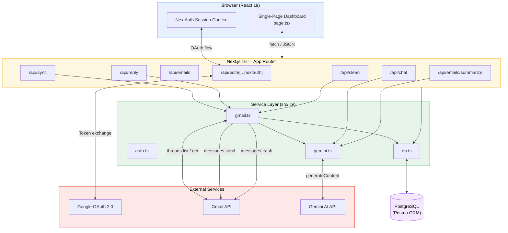
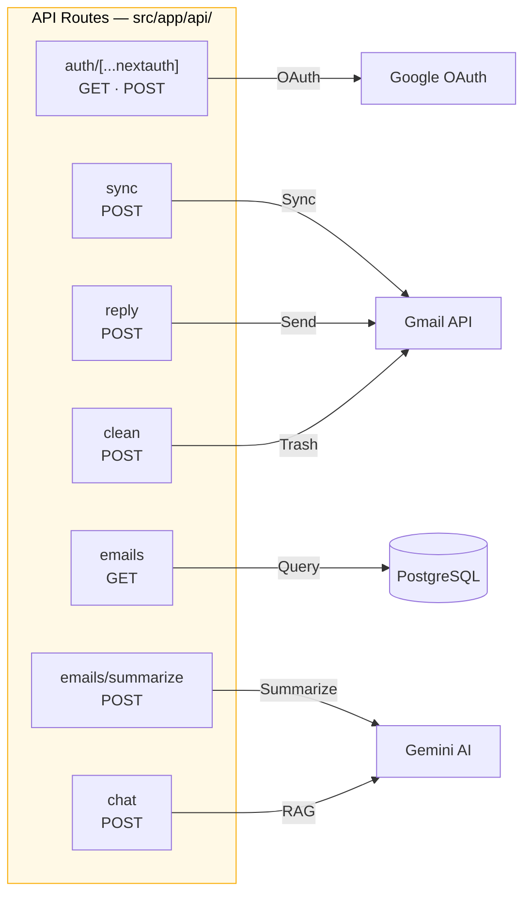
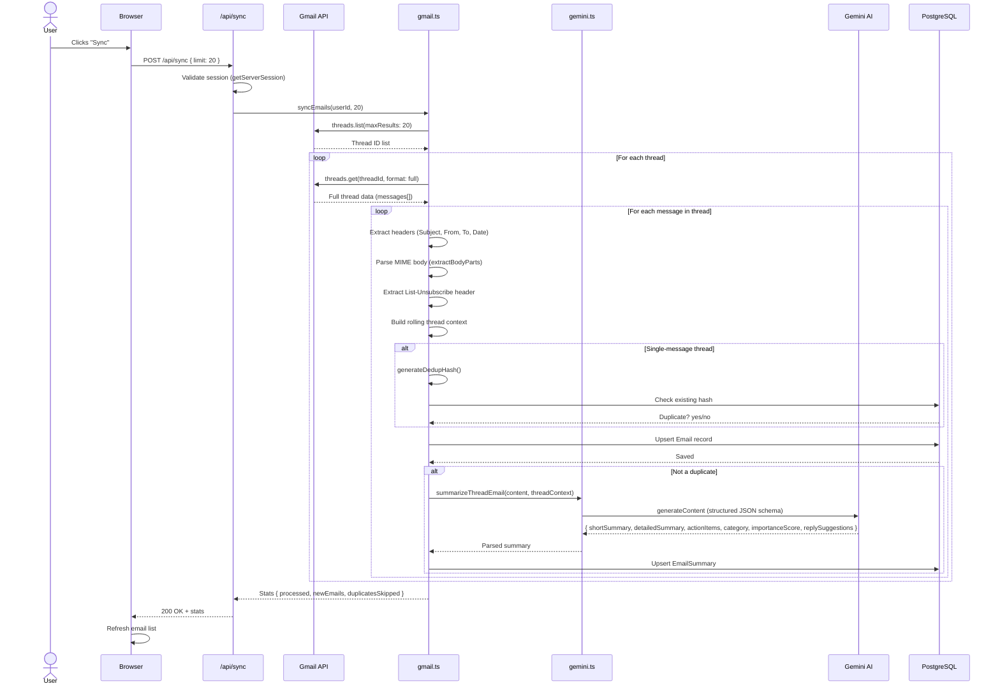
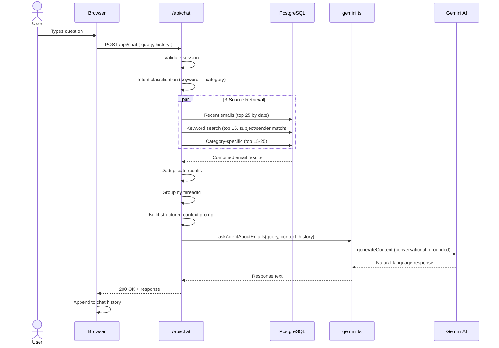
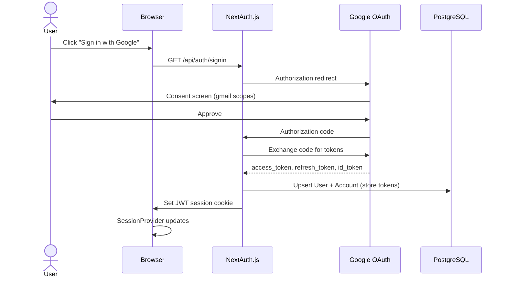

# Repeatless — Technical Architecture

> **AI-Powered Gmail Intelligence Platform**
> Version 0.1.0 · Next.js 16 · React 19 · Prisma · Google Gemini AI

---

## Table of Contents

- [1. Overview](#1-overview)
- [2. System Architecture](#2-system-architecture)
- [3. Technology Stack](#3-technology-stack)
- [4. Frontend Architecture](#4-frontend-architecture)
- [5. Backend Architecture](#5-backend-architecture)
  - [5.1 API Routes](#51-api-routes)
  - [5.2 Service Layer](#52-service-layer)
- [6. Database Schema](#6-database-schema)
- [7. AI Pipeline](#7-ai-pipeline)
- [8. Authentication & Security](#8-authentication--security)
- [9. Key Design Decisions](#9-key-design-decisions)

---

## 1. Overview

Repeatless is a **Next.js 16 (App Router)** application that connects to a user's Gmail account via **OAuth 2.0**, syncs email threads, processes them with **Google Gemini AI** for structured summarization and categorization, and presents the results through an intelligent, multi-view workspace UI.

### Core Capabilities

| Capability | Description |
|---|---|
| **Email Sync** | Thread-first Gmail synchronization with MIME parsing and deduplication |
| **AI Summarization** | Structured summaries, action items, importance scoring, and reply suggestions via Gemini |
| **Conversational RAG** | Natural-language email assistant with 3-source retrieval-augmented generation |
| **Smart Reply** | AI-drafted replies with full thread context, sent via Gmail API with proper RFC 2822 threading |
| **Priority Matrix** | Importance-scored email triage across AI-detected categories |
| **Bulk Cleanup** | Strategy-based batch operations (duplicates, promotions) across Gmail and local DB |
| **Unsubscribe Hub** | Centralized discovery and one-click unsubscribe via `List-Unsubscribe` header extraction |

---

## 2. System Architecture

The following diagram illustrates the high-level data flow between all major components:



---

## 3. Technology Stack

| Layer | Technology | Version | Purpose |
|---|---|---|---|
| **Framework** | Next.js (App Router) | 16.2.9 | Full-stack React framework |
| **UI** | React | 19.2.4 | Component rendering |
| **Styling** | Styled-JSX + CSS Custom Properties | — | Scoped component styles + global design system |
| **Icons** | Lucide React | 1.20.0 | Icon set |
| **Auth** | NextAuth.js | 4.24.14 | OAuth 2.0 / JWT sessions |
| **ORM** | Prisma | 6.19.3 | Database access + migrations |
| **Database** | PostgreSQL | — | Persistent storage |
| **AI** | Google Gemini (`@google/genai`) | 2.8.0 | Summarization, chat, draft generation |
| **Email** | Google APIs (`googleapis`) | 173.0.0 | Gmail read/write/send |
| **Language** | TypeScript | 5.x | Type safety |

---

## 4. Frontend Architecture

### 4.1 Component Structure

The frontend is a **single-page client component** (`src/app/page.tsx`, ~3,700 lines) that manages the full dashboard experience. It is wrapped by a minimal root layout (`layout.tsx`) that provides the `SessionProvider` and global CSS.

```
src/app/
├── layout.tsx          # Root layout — SessionProvider, metadata, font imports
├── page.tsx            # Main dashboard (single "use client" component)
├── globals.css         # Design system — CSS custom properties, resets, base styles
├── page.module.css     # Scoped layout/utility classes
└── favicon.ico
```

### 4.2 UI Layout

The dashboard follows a **3-column layout** inspired by Google Workspace:

```
┌──────────────────────────────────────────────────────────────────┐
│  Header Bar (logo, search, sync button, user avatar)            │
├────────────┬──────────────────┬───────────────────────────────────┤
│            │                  │                                   │
│  Sidebar   │   Email List     │   Detail Pane                    │
│  (250px)   │   (380px)        │   (flex: 1)                      │
│            │                  │                                   │
│  • Inbox   │  Thread cards    │  Full email view                 │
│  • Priority│  w/ AI badges    │  AI summary panel                │
│  • Brief   │  category chips  │  Action items                    │
│  • Unsub   │  importance dots │  Smart reply composer            │
│  • Chat    │                  │  Thread timeline                 │
│            │                  │                                   │
└────────────┴──────────────────┴───────────────────────────────────┘
```

| Column | Width | Content |
|---|---|---|
| **Sidebar** | 250px fixed | Navigation tabs, category filters, sync controls |
| **Email List** | 380px fixed | Scrollable list of email cards with AI metadata |
| **Detail Pane** | Flex (remaining) | Selected email body, AI summary, reply composer, thread view |

### 4.3 Application Views (Tabs)

| Tab | Purpose |
|---|---|
| **Inbox** | Primary email list with category filters, search, and full detail view |
| **Priority Matrix** | Emails organized by AI-assigned importance score and category |
| **Daily Brief** | AI-generated summary digest of the day's most important emails |
| **Unsubscribe Hub** | Aggregated view of newsletters/promotions with `List-Unsubscribe` URLs |

### 4.4 State Management

State is managed entirely through **React hooks** — no external state library is used:

- **`useState`** — All UI state (selected email, active tab, filters, search query, chat history, compose mode, etc.)
- **`useEffect`** — Data fetching on mount and on dependency changes (emails, session)
- **`useMemo`** — Derived/computed values (filtered email lists, category counts, sorted results)

### 4.5 Design System

The design system is defined in `globals.css` via **CSS custom properties**:

| Token Category | Examples |
|---|---|
| **Colors** | `--color-primary`, `--color-surface`, `--color-text-secondary`, `--color-border` |
| **Typography** | `Inter` (body), `Plus Jakarta Sans` (headings), `Outfit` (display/accent) |
| **Spacing** | Consistent 4px / 8px grid via padding/margin utilities |
| **Borders & Radii** | `--radius-sm`, `--radius-md`, `--radius-lg` |
| **Shadows** | `--shadow-sm`, `--shadow-md`, `--shadow-lg` |
| **Transitions** | `--transition-fast`, `--transition-normal` |

The visual design follows a **Google Workspace-inspired light theme** with clean surfaces, subtle borders, and accent colors for AI-generated elements.

---

## 5. Backend Architecture

### 5.1 API Routes

All API routes live under `src/app/api/` and follow the Next.js App Router convention (`route.ts` exports).



---

#### `POST /api/auth/[...nextauth]`

**NextAuth catch-all handler.** Manages the complete OAuth 2.0 lifecycle with Google.

| Aspect | Detail |
|---|---|
| **Provider** | Google OAuth with `access_type: "offline"`, `prompt: "consent"` |
| **Scopes** | `openid`, `email`, `profile`, `gmail.readonly`, `gmail.modify`, `gmail.send` |
| **Session Strategy** | JWT (stateless, no server-side session store) |
| **`signIn` Callback** | Upserts `User` and `Account` records in Prisma |
| **`jwt` Callback** | Looks up the database user by email, attaches CUID as `token.uid` |
| **`session` Callback** | Exposes `session.user.id` (CUID) and `session.accessToken` to the client |

---

#### `POST /api/sync`

Triggers email synchronization from Gmail.

| Parameter | Type | Default | Description |
|---|---|---|---|
| `limit` | `number` | `20` | Maximum number of threads to sync |

**Response:**
```json
{
  "stats": {
    "processed": 20,
    "newEmails": 15,
    "duplicatesSkipped": 5
  }
}
```

Internally calls `syncEmails(userId, limit)` from `gmail.ts`, which performs thread-first sync with per-message Gemini summarization.

---

#### `GET /api/emails`

Fetches stored emails with optional filtering.

| Query Param | Type | Description |
|---|---|---|
| `category` | `string` | Filter by AI-assigned category |
| `search` | `string` | Full-text search across subject and sender |
| `includeDuplicates` | `boolean` | Whether to include emails flagged as duplicates |

Builds a dynamic Prisma `where` clause. Returns emails with their associated `EmailSummary` relation.

---

#### `POST /api/emails/summarize`

On-demand re-summarization for a single email (e.g., after a failed or incomplete summary).

| Body Field | Type | Description |
|---|---|---|
| `emailId` | `string` | Gmail message ID of the email to re-summarize |

Fetches the email, builds thread context from all emails sharing the same `threadId` (in chronological order), calls `summarizeThreadEmail()`, and upserts the resulting `EmailSummary`.

---

#### `POST /api/chat`

Conversational email assistant powered by RAG (Retrieval-Augmented Generation).

| Body Field | Type | Description |
|---|---|---|
| `query` | `string` | User's natural-language question |
| `history` | `array` | Prior conversation turns for context continuity |

**Processing Pipeline:**

1. **Intent Classification** — Keyword → category mapping to detect query intent
2. **3-Source RAG Retrieval:**
   - Recent emails — top 25 by date
   - Keyword search — top 15 matching subject/sender
   - Category-specific — top 15–25 from the detected category
3. **Thread-First Context Construction** — Groups retrieved emails by `threadId`, builds structured prompt
4. **Generation** — Calls `askAgentAboutEmails()` with full conversational history
5. **Special Mode** — Newsletter digest queries trigger a dedicated system prompt with semantic deduplication instructions

---

#### `POST /api/reply`

AI-assisted reply drafting and sending.

| Body Field | Type | Description |
|---|---|---|
| `action` | `"draft"` \| `"send"` | Whether to draft only or send immediately |
| `emailId` | `string` | Target email to reply to |
| `instruction` | `string` | User's guidance for the reply content |
| `subject` | `string` | _(send only)_ Final subject line |
| `body` | `string` | _(send only)_ Final reply body |

**Draft mode:** Fetches thread emails, builds context, calls `draftReply()` via Gemini → returns `{ subject, body }`.

**Send mode:** Calls `sendGmailReply()` which constructs a full RFC 2822 MIME message with proper `In-Reply-To` and `References` headers for correct thread association. Saves the sent email and a dummy summary to the local DB.

---

#### `POST /api/clean`

Batch email cleanup across Gmail and the local database.

| Body Field | Type | Description |
|---|---|---|
| `strategy` | `string?` | `"duplicates"` \| `"promotions"` \| `"both"` |
| `sender` | `string?` | Sender email for all-time cleanup via Gmail query |
| `emailIds` | `string[]?` | Specific email IDs to trash |

**Three operating modes:**

| Mode | Trigger | Behavior |
|---|---|---|
| **Specific IDs** | `emailIds` provided | Trashes the listed emails |
| **By Sender** | `sender` provided | Queries Gmail for all emails from sender across all time, trashes them |
| **Strategy** | `strategy` provided | Finds duplicates and/or promotions, trashes in batch |

Uses **resilient batch trashing**: chunks of 1,000 messages with individual-fallback on per-message errors. Cleans both Gmail (via API) and local database records.

---

### 5.2 Service Layer

The service layer lives in `src/lib/` and encapsulates all business logic, external integrations, and data access.

```
src/lib/
├── auth.ts      # NextAuth configuration & callbacks
├── db.ts        # Prisma client singleton
├── gemini.ts    # Google Gemini AI integration
└── gmail.ts     # Gmail API integration & sync engine
```

---

#### `auth.ts` — Authentication Configuration

Configures NextAuth with the Google OAuth provider and custom callbacks:

| Callback | Responsibility |
|---|---|
| `signIn` | Upserts `User` + `Account` records in Prisma on every sign-in |
| `jwt` | Enriches the JWT with the database user's CUID (`token.uid`) |
| `session` | Attaches `user.id` and `accessToken` to the client-visible session |

Provider settings: `access_type: "offline"` (enables refresh tokens), `prompt: "consent"` (always shows consent screen for reliable refresh token issuance).

---

#### `db.ts` — Prisma Client Singleton

Manages a single Prisma client instance with **global caching** to survive Next.js development hot-reloads.

| Environment | Log Levels |
|---|---|
| Development | `error`, `warn` |
| Production | `error` only |

---

#### `gemini.ts` — AI Integration

Provides three primary AI functions plus resilience utilities:

| Function | Input | Output | Description |
|---|---|---|---|
| `summarizeThreadEmail()` | Email content + thread context | Structured JSON via `responseSchema` | Generates: `shortSummary`, `detailedSummary`, `actionItems[]`, `category` (enum), `importanceScore` (1–10), `replySuggestions[]`. Uses a system instruction enforcing objectivity. |
| `askAgentAboutEmails()` | User query + email context + history | Free-text response | Conversational RAG agent with a zero-hallucination system prompt and strict grounding rules. Special newsletter digest mode with semantic deduplication instructions. |
| `draftReply()` | Thread context + user instruction | `{ subject, body }` JSON | Generates a contextual reply draft. Signs off with the user's name. |
| `retryWithBackoff()` | Async function | Function result | Generic retry wrapper: **4 retries**, **2.5× exponential backoff**. Catches `429`, `503`, quota exhaustion, and `RESOURCE_EXHAUSTED` errors. |
| `resolveModelName()` | Model name string | Canonical model ID | Maps various model name inputs to `gemini-2.0-flash-lite`. |

---

#### `gmail.ts` — Gmail Integration & Sync Engine

| Function | Description |
|---|---|
| `getGmailClient()` | Creates an authenticated Gmail API client. Reads OAuth tokens from the `Account` table. Registers an `oauth2Client.on('tokens')` listener that auto-persists refreshed tokens back to the DB. |
| `syncEmails()` | **Thread-first sync engine.** Lists threads (`maxResults`), fetches full thread data, processes each message: header extraction, recursive MIME body parsing (`text/plain` + `text/html`), `List-Unsubscribe` header extraction, rolling thread-context construction, deduplication check, `Email` record creation, and Gemini summarization call. |
| `sendGmailReply()` | Constructs an RFC 2822 MIME message with `In-Reply-To` and `References` headers for proper Gmail threading. Supports `threadId=null` for forwards (creates a new thread). Base64url-encodes the raw message for the Gmail API. |
| `generateDedupHash()` | Produces an MD5 hash of: normalized sender email + normalized subject (stripped of `Re:`/`Fwd:`, lowercased, alpha-only) + ISO year-week string. Used only for single-message threads. |

**Helper functions:**

| Helper | Purpose |
|---|---|
| `extractBodyParts()` | Recursive MIME tree traversal to extract `text/plain` and `text/html` parts |
| `parseUnsubscribeUrl()` | Extracts URL or `mailto:` link from the `List-Unsubscribe` header |
| `normalizeSender()` | Extracts the email address from display-name format (e.g., `"John Doe <john@example.com>"` → `john@example.com`) |
| `normalizeSubject()` | Strips `Re:`/`Fwd:` prefixes, lowercases, and removes non-alpha characters |
| `getYearWeekString()` | Returns an ISO year-week string (e.g., `2026-W25`) for dedup windowing |

---

## 6. Database Schema

The database uses **PostgreSQL** via **Prisma ORM**. The schema is defined in `prisma/schema.prisma`.

### 6.1 Entity-Relationship Diagram

```mermaid
erDiagram
    User {
        string id PK "CUID"
        string name "nullable"
        string email UK "nullable"
        datetime emailVerified "nullable"
        string image "nullable"
    }

    Account {
        string id PK "CUID"
        string userId FK
        string type
        string provider
        string providerAccountId
        string refresh_token "nullable"
        string access_token "nullable"
        int expires_at "nullable"
        string token_type "nullable"
        string scope "nullable"
        string id_token "nullable"
        string session_state "nullable"
    }

    Session {
        string id PK "CUID"
        string sessionToken UK
        string userId FK
        datetime expires
    }

    VerificationToken {
        string identifier
        string token UK
        datetime expires
    }

    UserPreference {
        string id PK "CUID"
        string userId FK_UK
        string categories "CSV default"
        int dedupWindowHrs "default: 168"
        string summaryModel "default: gemini-3.5-flash"
        string chatModel "default: gemini-3.5-flash"
    }

    Email {
        string id PK "Gmail message ID"
        string threadId "indexed"
        string userId FK "indexed"
        string subject
        string sender
        string receiver
        datetime date
        string bodySnippet
        string bodyContent
        string htmlContent "nullable"
        string unsubscribeUrl "nullable"
        string labels "CSV"
        boolean isDuplicate "default: false"
        string dedupHash "nullable"
        datetime createdAt
        datetime updatedAt
    }

    EmailSummary {
        string id PK "CUID"
        string emailId FK_UK
        string shortSummary
        string detailedSummary
        string actionItems "JSON"
        string category
        int importanceScore "1-10"
        string replySuggestions "JSON, nullable"
        datetime createdAt
        datetime updatedAt
    }

    SyncState {
        string id PK "CUID"
        string userId UK
        string lastHistoryId "nullable"
        datetime lastSyncAt
    }

    User ||--o{ Account : "has"
    User ||--o{ Session : "has"
    User ||--o{ Email : "has"
    User ||--o| UserPreference : "has"
    Email ||--o| EmailSummary : "has"
```

### 6.2 Model Details

| Model | Key Constraints | Notes |
|---|---|---|
| **User** | `email` unique | Central identity. Cascading deletes to all children. |
| **Account** | `(provider, providerAccountId)` unique | Stores OAuth tokens (`access_token`, `refresh_token`, `expires_at`). |
| **Session** | `sessionToken` unique | Used by NextAuth; JWT strategy means sessions are stateless in practice. |
| **VerificationToken** | `(identifier, token)` unique | Standard NextAuth email verification support. |
| **UserPreference** | `userId` unique (1:1 with User) | User-configurable categories (CSV), dedup window (default 168h = 1 week), AI model selection. |
| **Email** | `id` = Gmail message ID (not auto-generated) | Indexed on `threadId` and `userId`. `bodyContent` stores raw plaintext; `htmlContent` optionally stores HTML. |
| **EmailSummary** | `emailId` unique (1:1 with Email) | AI-generated structured data. `actionItems` and `replySuggestions` are JSON-stringified arrays. |
| **SyncState** | `userId` unique | Tracks sync position for incremental sync via `lastHistoryId`. |

---

## 7. AI Pipeline

### 7.1 Email Sync & Summarization Flow



### 7.2 Conversational RAG Flow



### 7.3 AI Model Configuration

| Function | Model | Output Format |
|---|---|---|
| Email Summarization | `gemini-2.0-flash-lite` | Structured JSON via `responseSchema` |
| Chat / RAG Agent | `gemini-2.0-flash-lite` | Free-text with grounding constraints |
| Reply Drafting | `gemini-2.0-flash-lite` | Structured JSON `{ subject, body }` |

All AI calls use `retryWithBackoff()` for resilience: **4 retries** with **2.5× exponential backoff**, handling rate limits (`429`), server errors (`503`), and quota exhaustion (`RESOURCE_EXHAUSTED`).

---

## 8. Authentication & Security

### 8.1 OAuth 2.0 Flow



### 8.2 Security Controls

| Control | Implementation |
|---|---|
| **Session Strategy** | JWT — stateless, signed with `NEXTAUTH_SECRET` |
| **API Route Protection** | Every API route calls `getServerSession()` and returns `401` if unauthenticated |
| **Token Storage** | OAuth tokens (`access_token`, `refresh_token`) stored in PostgreSQL `Account` table |
| **Token Refresh** | Automatic via `oauth2Client.on('tokens')` listener — refreshed tokens are persisted back to DB |
| **Cookie Security** | Signed and encrypted by NextAuth using `NEXTAUTH_SECRET` |
| **Data Boundary** | Email content only leaves the system to Gemini AI for summarization — no other third parties |
| **Content Truncation** | Body content is truncated to **10,000 characters** before being sent to Gemini, limiting data exposure |
| **Offline Access** | `access_type: "offline"` ensures refresh tokens are issued for background sync capability |
| **Consent Prompt** | `prompt: "consent"` forces explicit user approval on every auth flow |

---

## 9. Key Design Decisions

| Decision | Rationale |
|---|---|
| **Single-file page component (~3,700 lines)** | Optimizes for rapid prototyping and eliminates prop-drilling overhead. All state is colocated. Refactor candidate as the app matures. |
| **No external state management** | React 19's built-in hooks (`useState`, `useMemo`) are sufficient for the current complexity level. Avoids unnecessary dependency overhead. |
| **Styled-JSX over CSS modules** | Provides true scoped styles colocated with component logic. CSS custom properties in `globals.css` handle the design system layer. |
| **Thread-first sync** | Gmail's threading model is central to the UX. Syncing by thread (not individual messages) ensures complete conversation context for AI summarization. |
| **MD5 dedup hashing** | Lightweight deduplication for single-message threads (newsletters, notifications). Hash = `sender + normalized_subject + year_week`. Multi-message threads are exempt since they carry unique conversation value. |
| **JWT over database sessions** | Reduces database load. Session data is minimal (user ID + access token). Tradeoff: no server-side session revocation. |
| **Structured JSON schema for Gemini** | Using `responseSchema` in `generateContent` enforces consistent output shape, avoiding fragile regex/JSON parsing of free-text responses. |
| **Resilient batch operations** | Chunk size of 1,000 with per-message fallback in the cleanup pipeline ensures partial failures don't abort the entire batch. |
| **3-source RAG retrieval** | Combining recency, keyword relevance, and category specificity maximizes recall while maintaining precision for the conversational agent. |
