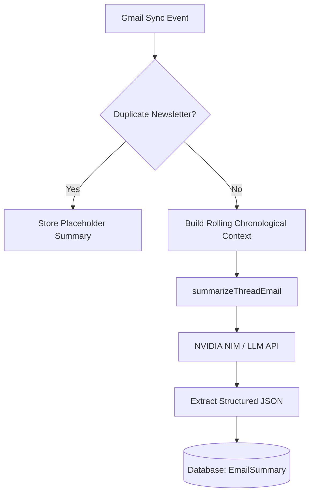
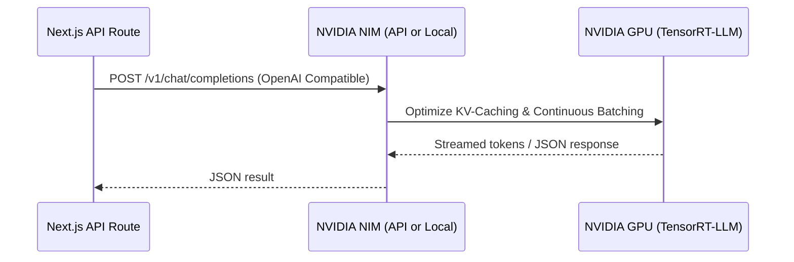

# Aether — AI Architecture & Design

Aether utilizes advanced Large Language Models (LLMs) to transform cluttered email streams into structured, actionable insights. By processing emails with a thread-first pipeline, Aether provides automated summarization, priority scoring, unsubscribe detection, smart reply drafts, and a conversational retrieval-augmented generation (RAG) assistant.

---

## 1. AI Pipeline Overview

The system processes incoming email threads via three specialized AI pipelines located in [gemini.ts](file:///Users/nani/Downloads/repeatless/src/lib/gemini.ts):



### 1.1 Thread-First Summarization (`summarizeThreadEmail`)
When a new email is fetched, it is not summarized in isolation. The system compiles the complete chronological thread history as surrounding context.
- **System Prompt**: Enforces strict JSON output formatting.
- **Extracted Fields**:
  - `shortSummary`: A concise 1-sentence summary (max 12 words) in plain language.
  - `detailedSummary`: A bulleted list of 2-3 key points.
  - `actionItems`: Target actions for the user (e.g. "Send budget file by Friday").
  - `category`: Classification into one of: `Newsletters`, `Job / Recruitment`, `Finance`, `Notifications`, `Personal`, `Work / Professional`.
  - `importanceScore`: An urgency score from 1 to 10 (8+ triggers high-priority UI indicators).
  - `replySuggestions`: Contextual quick-reply suggestions (e.g. "Confirm attendance").

### 1.2 Conversational RAG Assistant (`askAgentAboutEmails`)
Aether provides a personal assistant interface where users can ask questions about their emails.
- **Retrieval Mechanism**: Semantic search or recent email history compiles matching threads.
- **Grounding Rules**: The assistant is strictly bound by system instructions to avoid hallucinations. If the requested information is not in the compiled email context, it responds with: *"I cannot find any information about this in your synced emails."*
- **Newsletter Mode**: Semantically groups overlapping newsletter digests (e.g. ByteByteGo and TLDR reporting on the same tech release) and compiles a unified summary with source attributions.

### 1.3 Context-Aware Draft Generation (`draftReply`)
Generates formal draft responses based on:
- Chronological thread context.
- Short user-provided instructions (e.g., "accept but say I'll be 10 minutes late").
- User's name for signature formatting.

---

## 2. NVIDIA NIM Model Strategy

To scale Aether for low-latency enterprise workloads, the system incorporates support for **NVIDIA NIM (NVIDIA Inference Microservices)**. 

NVIDIA NIM containerizes optimized models (e.g., Llama 3.1/3.3, Mistral, Nemotron) with high-throughput engines like vLLM and TensorRT-LLM, allowing them to run locally, on private clouds, or via the NVIDIA API Catalog.



### 2.1 Benefits of NVIDIA NIM
- **Extreme Throughput**: Custom TensorRT engines process batch inference at up to 4x higher throughput.
- **Ultra-Low Latency**: Continuous batching and optimized KV-caching minimize Time-To-First-Token (TTFT) for draft generation.
- **Data Privacy & Compliance**: Because NIMs are packaged as standard OCI-compliant containers, they can be deployed inside a secure, private cloud network. The user's synced email text never leaves the private environment.

### 2.2 NIM Integration Code Pattern
Since NVIDIA NIM exposes a standard OpenAI-compatible API, it can be integrated directly into [gemini.ts](file:///Users/nani/Downloads/repeatless/src/lib/gemini.ts) by redirecting requests to the NVIDIA host:

```typescript
// Example integration function for NVIDIA NIM
async function fetchNvidiaNim(
  messages: { role: string; content: string }[], 
  model = "nvidia/llama-3.1-70b-instruct", 
  jsonMode = false
) {
  const apiKey = process.env.NVIDIA_API_KEY;
  const baseUrl = process.env.NVIDIA_NIM_BASE_URL || "https://integrate.api.nvidia.com/v1";

  const response = await fetch(`${baseUrl}/chat/completions`, {
    method: "POST",
    headers: {
      "Authorization": `Bearer ${apiKey}`,
      "Content-Type": "application/json",
    },
    body: JSON.stringify({
      model: model,
      messages: messages,
      response_format: jsonMode ? { type: "json_object" } : undefined,
      temperature: 0.2,
      max_tokens: 1024,
    }),
  });

  const data = await response.json();
  return data.choices[0].message.content;
}
```

### 2.3 Recommended Models

| NIM Model | Task | Configuration |
|---|---|---|
| **`meta/llama3-8b-instruct`** | Email Summarization & Categorization | Low latency, high throughput |
| **`meta/llama3-70b-instruct`** | Conversational RAG & News Digests | Deep reasoning, high context retention |
| **`nvidia/nemotron-4-340b-instruct`** | Premium Draft Composition | Professional and context-aware writing |
