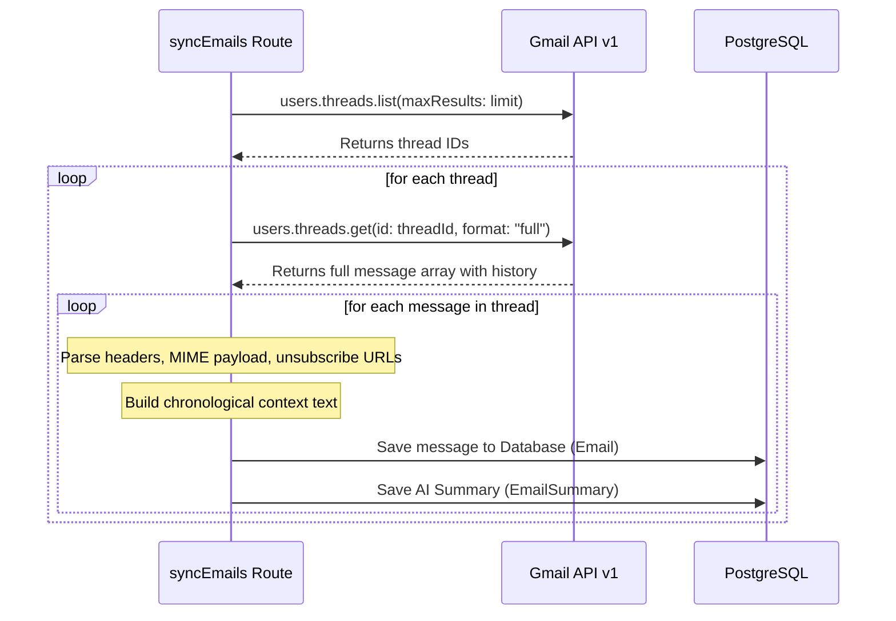

# Aether — Gmail API Strategy

This document outlines the synchronization, parsing, deduplication, and sending strategies employed by Aether when interfacing with the Google Gmail API.

---

## 1. Authentication & Token Management

Aether uses **NextAuth.js** with OAuth 2.0 to authenticate users against Google APIs.
- **Access and Refresh Tokens**: Stored in the PostgreSQL database under the `Account` table.
- **Automated Token Refresh**: Handled dynamically during request execution. When a Gmail client is requested via `getGmailClient(userId)` in [gmail.ts](file:///Users/nani/Downloads/repeatless/src/lib/gmail.ts), a listener listens for the `"tokens"` event:
  - If Google returns an updated `access_token`, `expires_at`, or `refresh_token`, the database record is updated automatically.
  - This prevents session expiration and guarantees uninterrupted background syncs.

---

## 2. Thread-First Synchronization

Rather than syncing individual messages flatly, Aether runs a **thread-first** sync pipeline to maintain conversation continuity.



### 2.1 Sync Details
1. **Thread Discovery**: Queries `gmail.users.threads.list` with a filter parameter `q: "-category:chats"` to exclude Google Chat histories.
2. **Contextual Retrieval**: Retrieves each thread via `gmail.users.threads.get` with `format: "full"`.
3. **MIME Parsing (`extractBodyParts`)**: Traverses the recursive message parts:
   - Extracts plain text (`text/plain`) and HTML (`text/html`) bodies.
   - If only HTML is present, text is generated by stripping scripts, styling, and HTML tags.
   - If only text is present, standard HTML boilerplate is wrapped around it.

---

## 3. Intelligent Deduplication Strategy

To prevent overloading both the database and the AI summarization APIs, Aether implements a custom hashing and deduplication filter.

### 3.1 Deduplication Hash (`generateDedupHash`)
For single-message threads (which represent newsletters, promo blasts, or automated alerts), we construct a hash:
```typescript
const signature = `${normSender}|${normSubject}|${weekString}`;
const dedupHash = crypto.createHash("md5").update(signature).digest("hex");
```
- **Sender Normalization**: Extracts raw email address and converts to lowercase.
- **Subject Normalization**: Strips prefix markers (like `Re:`, `Fwd:`, `Reply:`) and non-alphabetic characters.
- **Time Bucket (`getYearWeekString`)**: Generates a standard week string (e.g. `2026-W25`). Newsletters sent multiple times in a single week will share the same bucket.

### 3.2 Mitigation
If a duplicate newsletter is detected:
- The email content is saved.
- `isDuplicate` is set to `true`.
- Summarization is skipped, and a placeholder summary is written: `[Duplicate Newsletter] Similar newsletter sent this week.` to prevent redundant AI model calls and API costs.

---

## 4. Unsubscribe Detection

To power the **Unsubscribe Hub**, Aether parses the `List-Unsubscribe` header from incoming MIME structures.
- Extracts URLs wrapped inside angle brackets (`<...>`).
- Prioritizes direct HTTP/HTTPS URLs (e.g., `https://example.com/unsubscribe?id=123`).
- Falls back to `mailto` URIs if no HTTP links are available.
- Saves the resulting URL to the `unsubscribeUrl` field in the database.

---

## 5. RFC 2822 Compliant Threaded Replying

When a user drafts and sends a reply, Aether uses the `users.messages.send` endpoint to compose and place the reply accurately inside the existing thread.

### 5.1 E-mail Thread headers
To ensure that all email clients group Aether's responses into the original thread correctly, the system manually builds MIME headers:
1. **`In-Reply-To`**: Set to the `Message-ID` of the immediately preceding message.
2. **`References`**: Comprises a space-separated chain of all parent `Message-ID`s in the conversation.
3. **MIME Boundaries**: When attachments are present, the message content is compiled into a `multipart/mixed` structure with boundary lines separating the body text and base64-encoded attachment streams.
